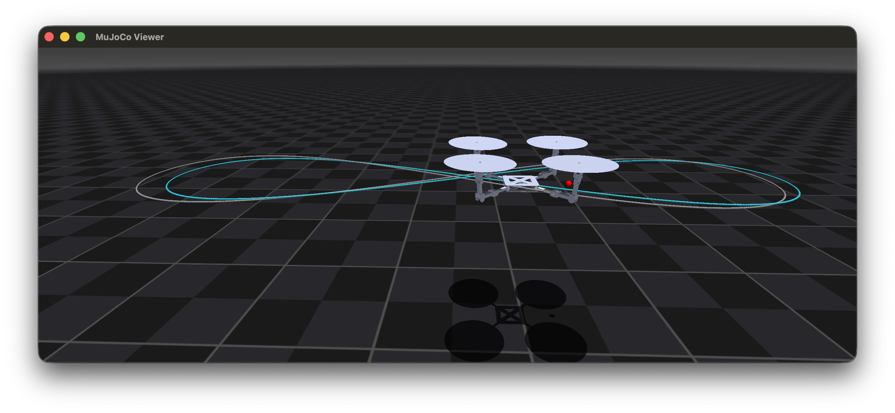

# STRIDER


Trajectory-following simulation of the STRIDER model (in MuJoCo).

---

## Features

- Flight Control: Geometric(SE(3)) Controller [[paper]](https://arxiv.org/pdf/1003.2005), [[code]](https://fdcl-gwu.github.io/uav_geometric_control/)
- CoM estimating: MOCE 2.0 [[paper]]()
- Control allocation: Sequential control allocation [[paper]](https://ieeexplore.ieee.org/document/11016760)
- Arm morphing: Acados NMPC [[github]](https://docs.acados.org)

---

### Dependencies
- C++ : MuJoCo / Eigen3 / GLFW3 / OpenGL
- Python3 : acados_template / pybind11 / numpy / matplotlib
- Tested: MacOS, Linux

### Build (CMake)

```bash
# (in root dir)
mkdir -p bild && cd build
cmake ..
make -j
```

### execution

```bash
cd build
./strider
```
- Can press space bar to toggle MPC control ON/OFF.
- Press ctrl+C to terminate.